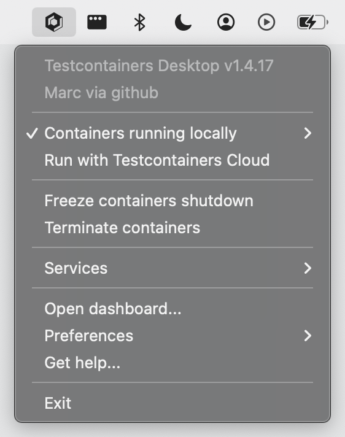

## Overview
[Testcontainers Desktop](/desktop/) is a companion app for [open source Testcontainers libraries](/) that makes local development and testing with real dependencies simple. It's a closed-source app available on MacOS, Windows, and Linux, that includes a [free plan](/cloud/pricing/) for individual developers. It's lightweight and runs in your system tray, so you can remain in your IDE while developing.

Note: why is this image not loading locally?

Open source Testcontainers libraries must remain self-sufficient to write and run tests, from desktop to CI. Testcontainers Desktop, as an optional desktop-only app, focuses on improving the developer experience. The features of Testcontainers Desktop are broken down into three main categories:

1. Select a container runtime
2. Debug Testcontainers-based services
3. Track and analyze test sessions

## 1. Select a container runtime
Open source Testcontainers libraries rely on a container runtime compatible with the Docker API. The following container runtime environments are officially supported:

* [Docker Desktop](https://www.docker.com/products/docker-desktop/)
* [Docker Engine](https://docs.docker.com/engine/install/) on Linux
* [Testcontainers Cloud](https://testcontainers.com/cloud/)
* Testcontainer Desktop's [embedded runtime](https://newsletter.testcontainers.com/announcements/adopt-testcontainers-desktop-as-your-container-runtime-early-access) (macOS only)

Refer to [this page](https://java.testcontainers.org/supported_docker_environment/) for more extensive information on supported container runtime environments, as well as known limitations of 
alternative container runtime environments.

### Switch between local runtimes

TODO: local runtimes

### Enable Testcontainers Desktop's embedded runtime

TODO: https://newsletter.testcontainers.com/announcements/adopt-testcontainers-desktop-as-your-container-runtime-early-access

### Run with Testcontainers Cloud

TODO: https://newsletter.testcontainers.com/announcements/switch-container-runtimes-and-burst-to-the-cloud

## 2. Debug Testcontainers-based services

### Set fixed ports to easily debug development services

TODO: https://newsletter.testcontainers.com/announcements/set-fixed-ports-to-easily-debug-development-services

TODO: https://newsletter.testcontainers.com/announcements/verify-running-services-and-spot-configuration-issues

TODO: https://newsletter.testcontainers.com/announcements/get-started-with-popular-technologies-thanks-to-preconfigured-services

### Freeze containers to prevent their shutdown while you debug

TODO: https://newsletter.testcontainers.com/announcements/freeze-containers-to-prevent-their-shutdown-while-you-debug

### Terminate containers

TODO: https://newsletter.testcontainers.com/announcements/clean-up-containers-without-manual-docker-commands

### Enable reusable containers

TODO: https://newsletter.testcontainers.com/announcements/enable-reusable-containers-with-a-single-click

## 3. Track and analyze test sessions

TODO: https://newsletter.testcontainers.com/announcements/inspect-local-test-sessions-in-collaborative-dashboards

### Troubleshooting

If you experience unexpected behavior with Testcontainers Desktop, there are a few common issues you can investigate and this guide may help resolve issues quickly. If you continue to have trouble, reach out to AtomicJar support for further assistance.

TODO:

* Prerequisites
* Reading logs
* Contacting support
* Joining slack