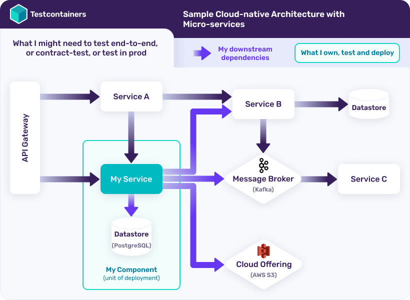
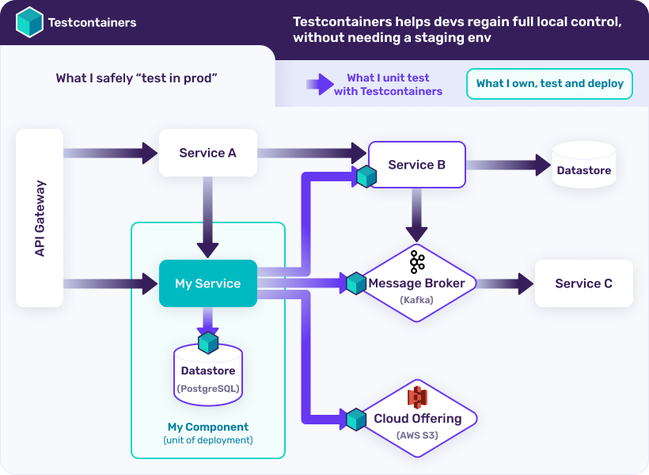
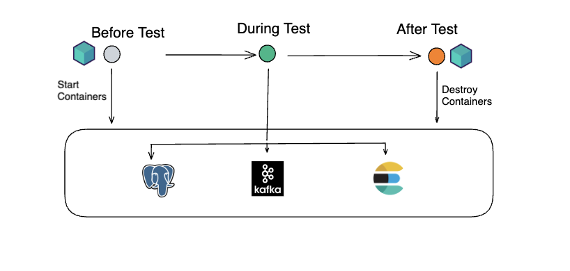

## What is Testcontainers?
Testcontainers is a library that provides easy and lightweight APIs for bootstrapping local development and test dependencies with real services wrapped in Docker containers. 
Using Testcontainers, you can write tests that depend on the same services you use in production without mocks or in-memory services.

### What problems does Testcontainers solve?
Cloud-native infrastructure and microservices have taken control away from developers and 
made it painful to work locally. Let's say you're a developer working on "My Service", 
within the following architecture:



While you own only My Service and its datastore (in green), you have several downstream dependencies 
(in blue) that you need for local development and integration testing. 
This brings the following challenges:

* Before running tests, you must ensure that the infrastructure is up and running and is pre-configured in a desired state.
* If the resources (database, message broker, etc) are shared across multiple users or CI pipelines, 
  then the test results are non-deterministic because of the possibility of data corruption and configuration drift.

One way to sidestep these challenges is by relying on in-memory databases, embedded services, mocks, 
and other fake replicas of the production dependencies. However, these approaches bring their 
own problems (e.g. In-memory services may not have all the features of your production service 
and behave slightly differently).

Testcontainers solves these problems by running your application dependencies such as databases, 
message brokers, etc. in Docker containers and helps executing reliable and repeatable tests by 
talking to those real services and providing a programmatic API for your test code.

In the previous example, you could freely develop and test "My Service" against real dependencies by provisioning them with Testcontainers, 
directly from your code:



### Benefits of using Testcontainers:

* **On-demand isolated infrastructure provisioning:**
You don't need to have a pre-provisioned integration testing infrastructure. 
Testcontainers will provide the required services before running your tests. 
There will be no test data pollution, even when multiple build pipelines run in parallel 
because each pipeline runs with an isolated set of services.

* **Consistent experience on both local and CI environments:**
You can run your integration tests right from your IDE, just like you run unit tests. 
No need to push your changes and wait for the CI pipeline to complete.

* **Reliable test setup using wait strategies:**
Docker containers need to be started and fully initialized before using them in your tests. 
The Testcontainers library offers several out-of-the-box wait strategies implementations to make sure 
the containers (and the application within) are fully initialized. 
Testcontainers modules already implement the relevant wait strategies for a given technology, 
and you can always implement your own or create a composite strategy if needed.

* **Advanced networking capabilities:**
Testcontainers libraries map the container's ports onto random ports available on the host machine 
so that your tests connect reliably to those services. You can even create a (Docker) network and 
connect multiple containers together so that they talk to each other via static Docker network aliases.

* **Automatic clean up:**
The Testcontainers library takes care of removing any created resources (containers, volumes, networks etc.) 
automatically after the test execution is complete by using the Ryuk sidecar container. 
While starting the required containers, Testcontainers attaches a set of labels to the 
created resources (containers, volumes, networks etc) and Ryuk automatically performs 
resource clean up by matching those labels. 
This works reliably even when the test process exits abnormally (e.g. sending a SIGKILL).

### Differences with Docker and Docker Compose
Docker and Docker Compose can also be used directly for spinning up dependencies that are needed for tests, 
but this approach has downsides. Creating reliable and fully-initialized service dependencies using 
raw Docker commands or using Docker Compose requires good knowledge of Docker internals and how to best 
run specific technologies in a container. For example, creating a dynamic "integration testing environment" 
by directly using Docker commands or docker-compose may result in port conflicts, containers not 
being fully initialized or ready for interactions when the tests start, etc. 
Testcontainers libraries leverage the full power of Docker containers under the hood and 
expose them to developers via idiomatic APIs.

## Supported languages and prerequisites
Testcontainers provide support for the most popular languages and platforms 
including Java, .NET, Go, NodeJS, Python, Rust and Haskell.



To run Testcontainers-based tests, you need a Docker-API compatible container runtime, such as using [Testcontainers Cloud](https://www.testcontainers.cloud/) or 
installing Docker locally. The following container runtime environments are officially supported:

* [Docker Desktop](https://www.docker.com/products/docker-desktop/)
* [Docker Engine on Linux](https://docs.docker.com/engine/install/)
* [Testcontainers Cloud](https://www.testcontainers.cloud/?utm_medium=direct&utm_source=testcontainers.com&utm_content=docs&utm_term=on-failure)

For more extensive information on supported container runtime environments, as well as known limitations of 
alternative container runtime environments, please refer to [this page](https://www.testcontainers.org/supported_docker_environment/).

## Testcontainers workflow
You can use Testcontainers with any testing library you are already familiar with. 
A typical Testcontainers-based integration test works as follows:



* **Before Test execution:**
Start your required services (databases, messaging systems etc.) as Docker containers using the Testcontainers API.
Once the required containers start, configure or update your application configuration to use these containerized services 
and optionally initialize data needed for the test.

* **During Test execution:** Your tests run using these containerized services.

* **After Test execution:**
Testcontainers takes care of destroying containers irrespective of whether tests are executed successfully or there were any failures.

### What technologies can I test with?
You can use Testcontainers to run tests with any Dockerized software. Testcontainers can spin up a container 
from any existing Docker image, a Dockerfile, or even from a Docker Compose file. 

### GenericContainer abstraction
Testcontainers provides a programmatic abstraction called GenericContainer representing a Docker container. 
You can use GenericContainer to start a Docker container, get any container information such as hostname 
(the host under which the mapped ports are reachable), mapped ports, and stop the container.

For example, you can use **GenericContainer** from **Testcontainers for Java** as follows:

```java
GenericContainer container = new GenericContainer("postgres:15")
        .withExposedPorts(5432)
        .waitingFor(new LogMessageWaitStrategy()
            .withRegEx(".*database system is ready to accept connections.*\\s")
            .withTimes(2)
            .withStartupTimeout(Duration.of(60, ChronoUnit.SECONDS)));
container.start();
var username = "test";
var password = "test";
var jdbcUrl = "jdbc:postgresql://" + container.getHost() + ":" + container.getMappedPort(5432) + "/test";
//perform db operations
container.stop();
```

The GenericContainer API is available for other supported languages as well.

## Testcontainers modules
Testcontainers provides modules for a wide range of commonly used infrastructure dependencies including relational databases, 
NoSQL datastores, search engines, message brokers, etc. See https://testcontainers.com/modules/ for a complete list.

Technology-specific [modules](https://testcontainers.com/modules/) are a higher-level abstraction on top of GenericContainer 
which help configure and run these technologies without any boilerplate, and make it easy to access their relevant parameters.

For example, you can use the Testcontainers [postgres module](https://testcontainers.com/modules/postgresql/)'s 
PostgreSQLContainer instead of GenericContainer as follows:

```java
PostgreSQLContainer postgres = new PostgreSQLContainer("postgres:15");
postgres.start();
var username = postgres.getUsername();
var password = postgres.getPassword();
var jdbcUrl = postgres.getJdbcUrl();
//perform db operations
postgres.stop();
```

Using modules makes it much simpler to interact with the technology by providing convenient helper methods such as **getJdbcUrl()**. 
Testcontainers modules also take care of implementing technology specific port mapping, appropriate wait strategies, etc.

## What's next?
You can get hands-on experience by working through task-oriented guides available at https://testcontainers.com/guides/. 
Finally, you should take a look at all the available Testcontainers modules at https://testcontainers.com/modules/ for ideas 
on how to migrate your existing test suites to Testcontainers.

Happy testing with Testcontainers!
